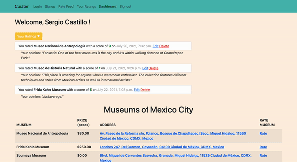

<h1>Curater</h1>
Curater is a Yelp-inspired site for reviewing museums in Mexico City. The backend is built with Python in the Django framework. 
The design has been made responsive through the use of Bootstrap and jQuery.
<h2>Features</h2>
<li>User registration and login with validations</li>
<li>User created data with validations</li>
<li>Ease of creating, editing, and deleting reviews</li>
<li>Google Maps connection to museum addresses</li>
<h2>Author</h2>
Sergio Castillo: <a href="https://github.com/castillocodes">https://github.com/castillocodes</a>
<h2>Demo</h2>
<h3>User Dashboard</h3>

<h3>Review Page</h3>
...
